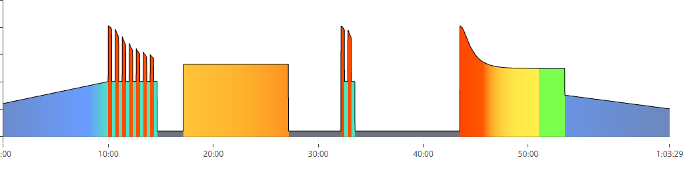
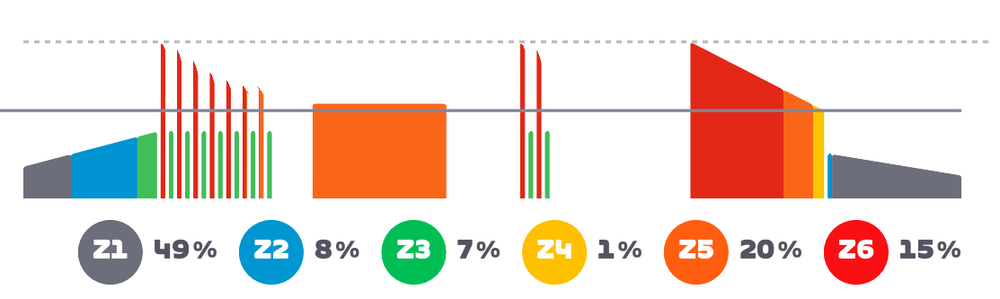
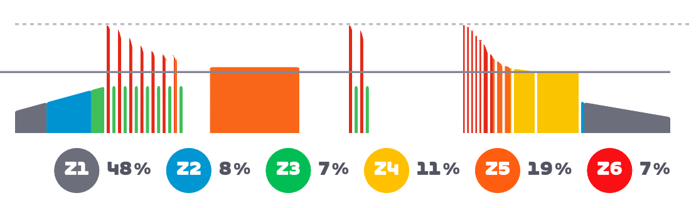
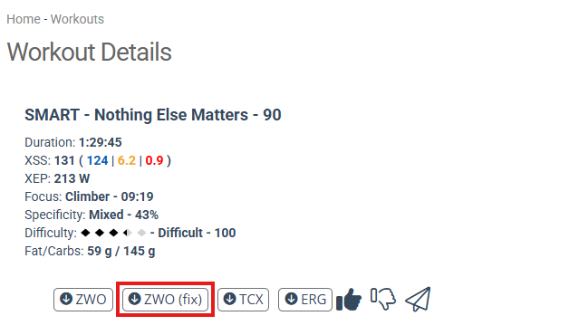

# Xert - Zwift Curvilinear Intervals fixed

## Goal

By default when a Xert workout is exported to Zwift, its curvilinear intervals are converted to standard Zwift linear ramps, making them very difficult. This project subdivides them into small linear ramps to better approach the expected curve.

## Example

**Xert Workout:**

**Zwift Before:**

**Zwift After:**

## How to use it?

1. Install [Tampermonkey](https://www.tampermonkey.net/) extension.
2. Create a new userscript and copy paste source from [./dist/userscript.js](./dist/userscript.js)
3. Enable the userscript.
3. A "ZWO (fix)" button will be added on Xert "Workout Details" page:
